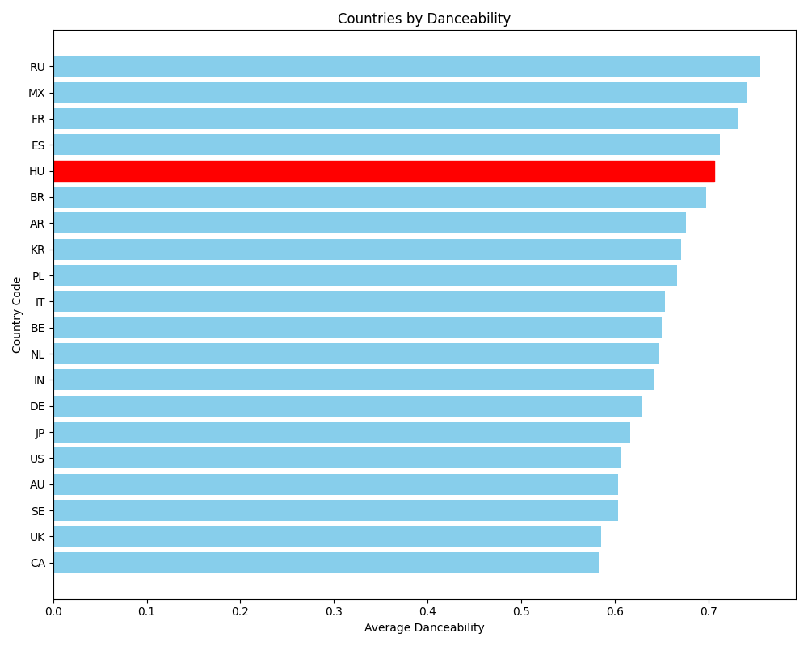

# Spotify Zenei Elemzés Projekt

Ez a projekt lehetővé teszi különböző országok **Top 50** zenéinek (minta valós aktuális adatok alapján, általában heti frissüléssel) elemzését, beleértve az átlagos táncolhatóságot (danceability - Spotify algoritmusai által kiszámított érték) és az 5 legnépszerűbb műfajt minden egyes ország számára. Az elemzés célja, hogy rangsoroljuk a különböző országokat az alapján, hogy melyik hallgatja a leginkább táncolható zenéket, valamint az 5 legnépszerűbb műfajt minden országban.

## Telepítés és Futtatás

### 0. Setup

A projekt futtatásához az alábbi eszközökre lesz szüksége:

- **Git**: Verziókezelő rendszer, amely letölthető [innen](https://git-scm.com/downloads).
- **Python 3.x**: A projekt Python 3.x verzióra van optimalizálva. Letölthető [innen](https://www.python.org/downloads/).
- **Spotify Developer Account**: A Spotify API használatához szükséges. Regisztrálhat [itt](https://developer.spotify.com/dashboard/applications).
- **Visual Studio Code - Python Extension**
Győződjön meg róla, hogy ezek az eszközök telepítve vannak a rendszerén, mielőtt folytatná a projekt telepítését és futtatását magáneszközön.  

A repositoryt GitHub Desktoppal, vagy (lehetőleg VS Code Terminal-ban) commanddal lehet lekérni:

```bash
git clone https://github.com/HeyItsMedard/dancing_countries.git
```

### 1. Telepítse a szükséges függőségeket

A projekt futtatásához szükség van néhány Python csomagra, melyeket az alábbi paranccsal telepíthet:

```bash
pip install spotipy python-dotenv pandas matplotlib time
```

### 2. .env fájl létrehozása

A Spotify API kulcsainak kezeléséhez szükséges egy `.env` fájl. Hozzon létre egy `.env` fájlt a következő tartalommal:

```plaintext
SPOTIFY_CLIENT_ID=your_spotify_client_id
SPOTIFY_CLIENT_SECRET=your_spotify_client_secret
```

Cserélje ki a `your_spotify_client_id` és `your_spotify_client_secret` értékeket a saját Spotify fejlesztői fiókából származó kulcsokra.   
Link: [Spotify Developer Dashboard](https://developer.spotify.com/dashboard/applications)  
Ha esetleg gondot okozna egy fejlesztői profil előállítása, kérje a fejlesztőtől a saját kliens adatait. Az API-nak lehet limitációi lekérésekben, így érdemes azzal számolni.  

### 3. Playlist ID-k lekérése

A program automatikusan letölti az egyes országok legnépszerűbb **Top 50** playlist ID-jait a Spotify kereső API segítségével. A playlistek az alábbi országokra vonatkoznak:  

- Egyesült Államok (US)
- Egyesült Királyság (UK)
- Németország (DE)
- Franciaország (FR)
- Olaszország (IT)
- Spanyolország (ES)
- Lengyelország (PL)
- Svédország (SE)
- Hollandia (NL)
- Belgium (BE)
- Oroszország (RU)
- Brazília (BR)
- India (IN)
- Ausztrália (AU)
- Japán (JP)
- Mexikó (MX)
- Argentína (AR)
- Dél-Korea (KR)
- Kanada (CA)
- Magyarország (HU)  

A playlist ID-kat a `playlists.json` fájlban tárolja a rendszer.  

### 4. Az elemzés futtatása

A `main()` függvény futtatásával az összes ország zenéjét elemezzük, és az eredményeket egy szöveges fájlba mentjük. Az elemzés során az alábbi adatok kerülnek kinyerésre és tárolásra:

- Átlagos táncolhatóság (danceability) százalékban
- Az 5 legnépszerűbb műfaj

A rangsor a táncolhatóság alapján készül, és az eredményeket a `country_analysis.txt` fájlba menti.  

A program végén egy képet is generál `dancers.png` néven, amely a táncolhatóság szerinti országok rangsorát ábrázolja, pirossal kiemelve Magyarországot.  

**FIGYELEM**:   
- a futtatás ideje percekbe is kerülhet.    
- túl gyakori lekérés [korlátot eredményezhet](https://community.spotify.com/t5/Spotify-for-Developers/Web-API-ratelimit/td-p/5330410).    


### 5. Kép megtekintése (`dancers.png`)



### Jegyzetek

- HA ESETLEG VÁLTOZÁS TÖRTÉNNE A LEJÁTSZÁSI LISTÁK ADATÁBAN VAGY HIÁNYZIK A JSON FILE, KEZDJE A `save_to_json.py` FUTTATÁSÁVAL!
- Az elemzéshez a zenék táncolhatósági mutatója (danceability) és az előadók számainak műfajai szükségesek, amelyeket a Spotify API-ból kérdezünk le. Ehhez viszont rengeteg lekérdezésre van szükségünk.  
- A program Python 3.x verzióra van optimalizálva, személy szerint 3.11.9-et használtam, biztosra kell menni, hogy PATH-nél megvan adva Python.
- Ha bármi is meglepett ezek közül személyesen engem, az az, hogy megvertük Brazíliát táncolhatóságban! 🕺
